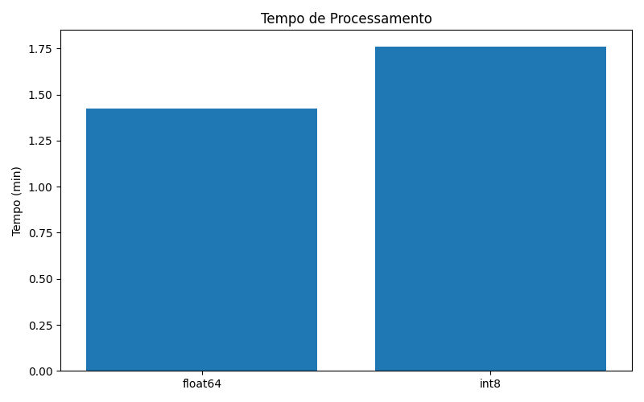
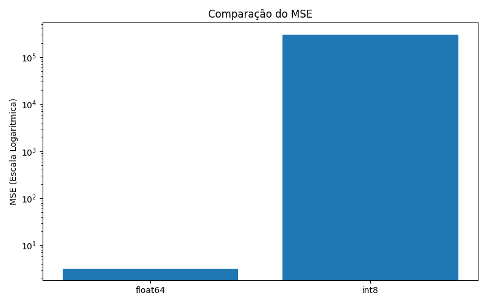
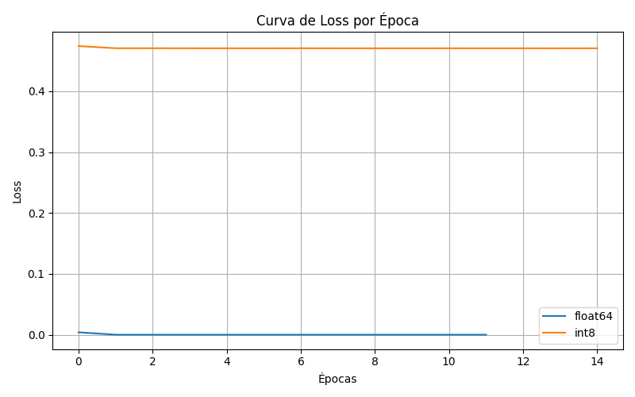

# Global Solution – Sistemas Operacionais

## Análise da Influência dos Padrões Numéricos int8 e float64 no Treinamento de uma Rede Neural MLP Aplicada a Dados de Pouso Aeronáutico

---

## Integrantes

| Nome | RM |
|--------|--------|
| Eduardo Mazelli | RM553236 |
| Lucas Masaki | RM553084 |
| Pedro Henrique Lima | RM552746 |
| Carolina Cavalli | RM552925 |
| Joseh Gabriel Trimboli Agra | RM553094 |

---

## Sobre o Projeto

Este projeto foi desenvolvido para a disciplina de Sistemas Operacionais da FIAP e tem como objetivo analisar a influência dos padrões numéricos **float64** e **int8** no treinamento de uma Rede Neural Artificial do tipo MLP (Multilayer Perceptron).

O estudo utiliza um conjunto de dados sintético representando condições de pouso de aeronaves e compara o impacto dos diferentes formatos numéricos em relação à precisão das previsões, desempenho computacional e comportamento do treinamento.

---

## Questão de Pesquisa

**Como os padrões numéricos int8 e float64 influenciam a precisão e o desempenho de uma rede neural MLP aplicada à inferência de dados de pouso de aeronaves em sistemas embarcados com Kernel de 64 bits?**

---

## Objetivo Geral

Avaliar a influência dos padrões numéricos int8 e float64 sobre a qualidade das inferências e o desempenho computacional de uma rede neural artificial aplicada a dados aeronáuticos.

---

## Objetivos Específicos

- Construir um conjunto de dados representando condições de pouso aeronáutico;
- Explorar, tratar e preparar os dados;
- Implementar uma rede neural MLP;
- Treinar a rede utilizando float64;
- Treinar a rede utilizando int8;
- Comparar métricas de desempenho e qualidade;
- Avaliar a influência da preempção do sistema operacional.

---

## Tecnologias Utilizadas

- Python 3.14
- NumPy
- Pandas
- Scikit-Learn
- Matplotlib
- Memory Profiler

---

## Estrutura do Projeto

```text
GS-Sistemas-Operacionais
│
├── data/
│   └── pouso_aeronave.csv
│
├── docs/
│   └── Global Solutions OS.pdf
│
├── src/
│   ├── gerar_dataset.py
│   ├── treino_float64.py
│   ├── treino_int8.py
│   └── graficos.py
│
├── loss.png
├── mse.png
├── mae.png
├── tempo_processamento.png
│
└── README.md
```

---

## Dataset

Foi desenvolvido um dataset sintético contendo aproximadamente 6 milhões de registros para simular condições de pouso aeronáutico.

### Variáveis de Entrada

- Velocidade de aproximação
- Altitude
- Taxa de descida
- Vento lateral
- Peso da aeronave

### Variável Alvo

- Distância de pouso

Os dados foram normalizados utilizando a técnica StandardScaler antes do treinamento dos modelos.

---

## Equações Cinemáticas Utilizadas

As condições de pouso foram modeladas utilizando conceitos básicos da cinemática.

### Equação da Velocidade

```math
v = v_0 + at
```

Onde:

- v = velocidade final
- v₀ = velocidade inicial
- a = aceleração
- t = tempo

### Equação da Posição

```math
s = s_0 + v_0t + \frac{1}{2}at^2
```

Onde:

- s = posição final
- s₀ = posição inicial
- v₀ = velocidade inicial
- a = aceleração
- t = tempo

---

## Arquitetura da Rede Neural

Foi utilizada uma rede neural do tipo **MLP (Multilayer Perceptron)** com a seguinte configuração:

- 5 neurônios de entrada
- 1 camada oculta
- 20 neurônios na camada oculta
- Função de ativação Sigmoid (Logistic)
- 1 neurônio de saída

A implementação foi realizada utilizando a biblioteca Scikit-Learn.

---

## Experimentos Realizados

Foram executados dois treinamentos independentes:

### Float64

Utilizando o padrão numérico de alta precisão:

```python
float64
```

### Int8

Utilizando representação reduzida:

```python
int8
```

O objetivo foi comparar o impacto da representação numérica na qualidade das previsões produzidas pela rede neural.

---

## Resultados Obtidos

| Métrica | Float64 | Int8 |
|----------|----------|----------|
| Tempo (min) | 1.4237 | 1.7628 |
| MSE | 3.1707 | 304327.4105 |
| MAE | 1.2637 | 457.3551 |

---

## Análise dos Resultados

Os resultados demonstram que o padrão **float64** apresentou desempenho significativamente superior ao padrão **int8**.

O modelo treinado utilizando float64 obteve valores muito baixos de erro, indicando elevada capacidade de aproximação dos valores reais.

Já o modelo treinado utilizando int8 apresentou degradação significativa da qualidade das previsões devido à limitação de representação numérica desse formato.

Apesar do menor consumo de memória do padrão int8, os resultados indicam que sua utilização pode comprometer a precisão em aplicações críticas.

---

## Gráficos

### Tempo de Processamento



---

### Comparação do MSE



---

### Comparação do MAE


---

### Curva de Loss



---

## Influência da Preempção do Sistema Operacional

A preempção é um mecanismo utilizado pelos sistemas operacionais para interromper temporariamente a execução de um processo e permitir a execução de outro processo considerado prioritário.

Durante o treinamento da rede neural podem ocorrer trocas de contexto realizadas pelo escalonador do sistema operacional.

Essas interrupções podem aumentar o tempo total de processamento, porém não alteram diretamente os cálculos matemáticos executados pela rede neural.

Em sistemas embarcados aeronáuticos, a previsibilidade temporal é um fator importante para garantir segurança e confiabilidade operacional.

---

## Como Executar o Projeto

### Instalar Dependências

```bash
pip install pandas numpy matplotlib scikit-learn memory-profiler
```

### Gerar o Dataset

```bash
python src/gerar_dataset.py
```

### Treinar o Modelo Float64

```bash
python src/treino_float64.py
```

### Treinar o Modelo Int8

```bash
python src/treino_int8.py
```

### Gerar os Gráficos

```bash
python src/graficos.py
```

---

## Relatório

O relatório completo do projeto encontra-se na pasta:

```text
docs/Global Solutions OS.pdf
```

---

## Disciplina

**Sistemas Operacionais**


---

## Licença

Projeto desenvolvido exclusivamente para fins acadêmicos na FIAP.
